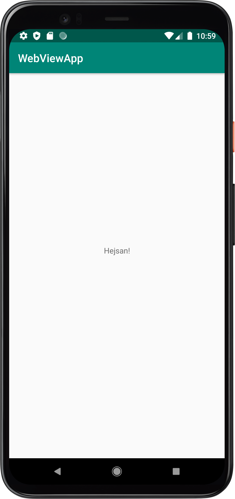

# Rapport

Uppgift 1 rörde sig om att ändra "Hello World!" till valfri textutdrag. Jag valde att skriva "Hejsan!".

```
<TextView
        android:layout_width="wrap_content"
        android:layout_height="wrap_content"
        android:text="Hejsan!"
        app:layout_constraintBottom_toBottomOf="parent"
        app:layout_constraintLeft_toLeftOf="parent"
        app:layout_constraintRight_toRightOf="parent"
        app:layout_constraintTop_toTopOf="parent" />
```
Bild på vad koden gör kan bli funnen nedan:



